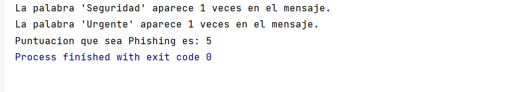

# Actividad # 6 - DESARROLLAR UN PROGRAMA EXPLORADOR DE PHISHING EN JAVA

---

El phishing es una forma de robo de identidad, en la que mediante un correo electrónico el emisor se hace pasar por una fuente confiable e intenta adquirir información privada como nombres de usuario, contraseñas, números de tarjetas de crédito y número de seguro social. Los correos electrónicos de phishing que afirman provenir de bancos, compañías de tarjetas de crédito, sitios de subastas, redes sociales y sistemas de pago en línea populares pueden tener una apariencia bastante legítima. A menudo, estos mensajes fraudulentos proveen vínculos a sitios Web falsificados, en donde se pide al usuario que introduzca información confidencial.

Para esta actividad usted tendrá que crear un repositorio privado en GitHub y añadir como desarrollador del proyecto al docente; y en este deberá subir un programa explorador de phishing. Para esto Usted deberá:

---

<ol id="yui_3_17_2_1_1690559473875_46"><li>Investigar
estafas de phishing en línea y visitar sitios web como el del Grupo de trabajo
anti-phishing (<a href="http://www.antiphishing.org/" style="font-size: 0.9375rem; background-color: rgb(255, 255, 255);">www.antiphishing.org/</a>);
y buscar información sobre las estafas más recientes y cómo protegerse a sí
mismo.</li><li>Con esa
información, Usted debe crear una lista de 30 palabras, frases y nombres de
compañías que se encuentren frecuentemente en los mensajes de phishing y asignarle
el valor de un punto a cada una, con base en una estimación de la probabilidad
de que aparezca en un mensaje de phishing (por ejemplo, un punto si es poco
probable, dos puntos si es algo probable, o tres puntos si es muy probable). </li><li>Escriba una
aplicación que explore un archivo de texto en busca de estos términos y frases
en java.</li><li>Para cada
ocurrencia de una palabra clave o frase dentro del archivo de texto, agregue el
valor del punto asignado para esa palabra o frase al total de puntos acumulados.
</li><li>Además, para
cada palabra clave o frase encontrada, deberá imprimir en pantalla una línea
con la palabra o frase, el número de ocurrencias y el total de puntos; </li><li>Finalmente muestre
el total de puntos para todo el mensaje. </li></ol>

---

---

## Lista de palabras elegidas para nuestro programa 
|        Palabra/Frase         | Probabilidad |
|:----------------------------:|--------------|
|           Urgente            | 3            |
|       Cuenta bloqueada       | 3            |
|    Verificar información     | 3            |
|    Actualizar información    | 3            |
|        Iniciar sesión        | 3            |
|        Haga clic aquí        | 3            |
|          Contraseña          | 2            |
|          Seguridad           | 2            |
|          Confirmar           | 2            |
|            Alerta            | 2            |
|           Problema           | 2            |
|       Acción requerida       | 2            |
|    Información importante    | 2            |
|     Cambio de contraseña     | 2            |
|     Suspensión de cuenta     | 2            |
|    Verificación de cuenta    | 2            |
|       Acceso limitado        | 1            |
|    Restablecer contraseña    | 1            |
|  Notificación de seguridad   | 1            |
|      Mensaje importante      | 1            |
|    Ingreso no autorizado     | 1            |
|     Actividad sospechosa     | 1            |
|      Proteja su cuenta       | 1            |
|  Actualización de seguridad  | 1            |
|  Instrucciones de seguridad  | 1            |
|   Información confidencial   | 1            |
|       Datos personales       | 1            |
|      Robo de identidad       | 1            |
|       Fraude en línea        | 1            |
|     Amenaza de seguridad     | 1            |

---
---

## Mensaje a analizar 

Estimado(a) [Nombre del Usuario],
Le escribimos para informarle que hemos detectado actividad sospechosa en su cuenta. Con el fin de proteger la seguridad de su cuenta y sus datos personales, es necesario que verifique su información y realice algunas acciones de seguridad de inmediato.
Por favor, haga clic en el siguiente enlace para iniciar sesión en su cuenta y proceder con la actualización de su información de seguridad: [Enlace seguro de inicio de sesión]
Una vez que haya iniciado sesión, deberá confirmar su contraseña y seguir las instrucciones proporcionadas para restablecer el acceso a su cuenta. Le recomendamos que elija una contraseña segura y única para fortalecer la protección de su cuenta.
Este problema requiere una acción urgente de su parte. Si no se realiza el cambio de contraseña y se actualiza la información requerida, su cuenta podría ser suspendida temporalmente por razones de seguridad.
Entendemos lo importante que es proteger sus datos personales y evitar el robo de identidad y el fraude en línea. Este mensaje tiene el propósito de alertarle sobre la situación y ayudarle a tomar medidas para proteger su cuenta de cualquier amenaza de seguridad.
Para asegurar la integridad de su cuenta y mantenerla protegida, le pedimos que siga cuidadosamente todas las instrucciones proporcionadas. Si tiene alguna duda o necesita asistencia adicional, no dude en contactar a nuestro equipo de soporte, quienes estarán dispuestos a ayudarle.
Agradecemos su comprensión y cooperación en este asunto urgente. La seguridad de nuestros usuarios es nuestra prioridad y estamos comprometidos a garantizar un entorno seguro para todos.
Atentamente,
El Equipo de Seguridad en Línea
[Nombre de la Compañía]

---

---

